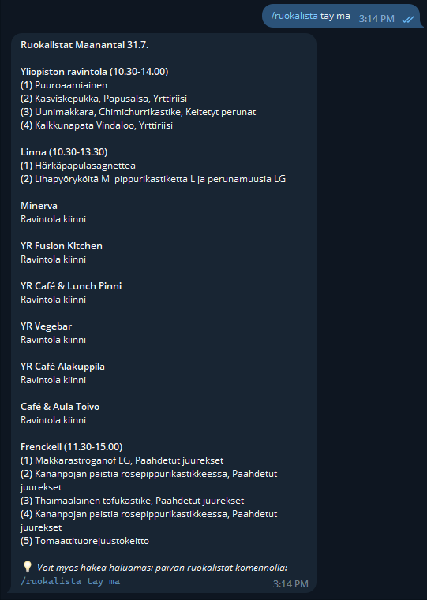

<br />

## Simple Telegram bot for fetching student restaurant menus

Unisafka-telegram is a user-friendly and efficient bot designed to cater to the needs of students in the Tampere area. As the name suggests, it serves as a helpful assistant, providing easy access to the daily menus of various student restaurants within the city. Developed to streamline the process of finding affordable and delicious meals, Unisafka-telegram has quickly become an indispensable tool for students looking to satisfy their hunger without breaking the bank. [Bot's telegram link](https://t.me/Unisafka_bot)


## Development setup:
Prerequisites:
**Node.js 16.XX =>**

Install dependencies
```
npm i

```

Start up development mode
```
npm run dev
```


### Example images:



## Crediting original:
Project is based on [Unisafka.fi](https://unisafka.fi/) API. 
